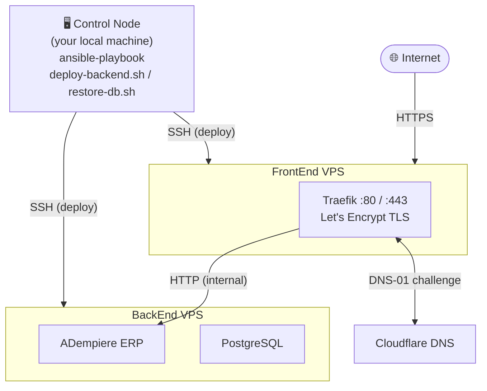

# ADempiere Deployment & Installation

- This project automates the deployment and ongoing administration of [ADempiere ERP](https://github.com/adempiere/adempiere) on Linux VPS servers using [Ansible](https://docs.ansible.com/).
- It covers the full lifecycle: OS hardening, Docker installation, ADempiere container stack deployment, database restores, OS updates, and more — from a freshly provisioned server to a running production instance, and every day-2 task thereafter.

> **Traefik (FrontEnd / HTTPS) is optional and not yet fully implemented.**  
> ADempiere runs completely without it. The BackEnd deployment (`deploy-backend.sh`) works end-to-end.  
> The FrontEnd (Traefik reverse proxy + Let's Encrypt TLS) is partially implemented — key pieces are missing before it can be used in production. See [docs/traefik-status.md](docs/traefik-status.md) for the current state and open tasks.

---

## Table of Contents

- [Control node](#control-node)
- [The scenario](#the-scenario)
- [Benefits](#benefits)
- [Ansible building blocks](#ansible-building-blocks)
- [Quick start](#quick-start)
- [Scripts and playbooks](#scripts-and-playbooks)
- [Documentation](#documentation)
- [License](#license)

---

## Control node

The **control node** is your own workstation or laptop — the machine from which you run all commands.   
It is not a server being deployed. Nothing runs on it permanently once the deployment is complete.

Ansible connects **outbound** from the control node to the servers over SSH and executes tasks remotely.   
The servers never initiate contact or pull configuration.

All operator-specific files live on the control node: `group_vars/all/vars.yml`, `group_vars/all/vault.yml`, the SSH keypair (`ssh_keys/`), the vault password file (`~/.vault_pass.txt`), and all deployment logs (`logs/`). None of these are committed to git.

The control node requires only Ansible (core 2.14+) and three collections (`community.docker`, `community.postgresql`, `community.crypto`). No Docker, no ADempiere, no server software.



---

## The Scenario

- You are working on your **local machine** (the *control node*).
- You have two Linux VPS servers — one serves as the application backend, one as the public-facing frontend.
- For a first-time setup, the servers need to be reachable via SSH. Root access is required for the initial hardening steps; subsequent steps use a dedicated non-root user.

```
                                    FrontEnd VPS  (<frontend_ip>)
Your local machine  ──── SSH ────►  Public-facing server.
                    │               Runs Traefik: receives internet traffic,
                    │               terminates HTTPS, forwards to BackEnd.
                    │                         │
                    │                         │ HTTP (internal)
                    │                         ▼
                    │               BackEnd VPS   (<backend_ip>)
                    └──── SSH ────► Application server.
                                    Runs ADempiere ERP + PostgreSQL database.
                                    ⚠ Also directly reachable from the internet
                                      unless the hosting provider's firewall
                                      restricts access. No firewall is configured
                                      by this project.
```

After a full BackEnd deployment, the following will be in place:

- Both servers are **hardened**: SSH runs on a custom port, root login is disabled, only key-based authentication is allowed, automatic security updates are enabled.  
- Both servers have **Docker CE** installed.  
- The **BackEnd** server runs the ADempiere ERP container stack (application + PostgreSQL database).  
- Optionally: the **FrontEnd** server runs **Traefik**, a reverse proxy that terminates HTTPS using a Let's Encrypt certificate issued via the Cloudflare DNS API and forwards requests to the BackEnd. See [docs/traefik-status.md](docs/traefik-status.md) before enabling this.

Configuration is split across two gitignored files under `group_vars/all/`:  
- `vars.yml` — plain-text deployment values (SSH port, username, key path). Copy from `group_vars/vars_template.yml`.  
- `vault.yml` — AES-256 encrypted secrets (passwords, API tokens). Copy from `group_vars/vault_template.yml` and encrypt with `ansible-vault encrypt`.  

The templates live one level up in `group_vars/` (not inside `all/`) because Ansible auto-loads every `.yml` file it finds in `group_vars/all/` — placing templates there would cause their placeholder values to override your real credentials.

The vault password must be stored in `~/.vault_pass.txt` on the control node; `ansible.cfg` references this file so Ansible decrypts the vault automatically on every run.  
**Change the vault password before deploying to production.** See [docs/vault.md](docs/vault.md).

You run all commands from your local machine.  
Ansible connects to the servers over SSH and handles everything remotely.

---

## Benefits

- **One-command server setup** — `./deploy-backend.sh` takes a freshly provisioned VPS and fully deploys ADempiere in a single step: OS hardening, swap, Docker, the full ADempiere container stack, and crontab — no manual steps in between.

- **Hardening out of the box** — every server gets SSH port customization, key-based authentication only, root login disabled, MaxAuthTries enforced, modern cipher suites, and automatic unattended security upgrades — applied consistently to every deployment without any manual configuration.

- **Not just a one-time installer — a full administration toolkit** — the same Ansible playbooks that deploy the server are also used day-to-day: apply OS updates, rotate SSH keys, update ADempiere to a new version, force a clean container restart, restore a database, or re-run any individual step in isolation. See [docs/operations.md](docs/operations.md).

- **Database restore in two steps** — download a backup to your workstation, set two variables in `vars.yml`, and run `./restore-db.sh`. The script displays all restore parameters and asks for explicit confirmation before touching anything.

- **Automatic health verification** — after every fresh deployment, [`health-check.sh`](https://github.com/adempiere/adempiere-ui-gateway/blob/main/docker-compose/health-check.sh) runs automatically and checks every container and HTTP endpoint. The play fails immediately if anything is unhealthy, so a broken deployment is never silently accepted.

- **Dry-run before you commit** — `./deploy-backend.sh --check` shows exactly what would change on the server without making a single write.

- **Idempotent and self-correcting** — every playbook is safe to re-run at any time. If a step fails halfway through, fix the issue and re-run: steps that already succeeded report `ok`, pending steps pick up where they left off.

- **Repeatable across environments** — the same playbooks deploy to development, staging, and production. Per-environment differences live entirely in gitignored `vars.yml` and `vault.yml`; nothing environment-specific is ever committed.

- **Transparent by design** — both entry-point scripts display a full configuration summary — target server, all settings, vault variable status — before any confirmation prompt, so the operator knows exactly what will run before typing `YES`.

- **Seamless server resets** — before connecting to any BackEnd server, `deploy-backend.sh` automatically removes the old SSH host fingerprint from `~/.ssh/known_hosts`. Reinstalling a server no longer requires a manual `ssh-keygen -R` step — the script handles it silently every time.

- **All configuration in version control** — deployment logic, role defaults, and templates are committed; secrets are AES-256 encrypted in `vault.yml`. The exact deployment is fully reproducible at any point in time.

---

## Ansible Building Blocks

> New to Ansible? See [docs/technologies.md](docs/technologies.md) for a short introduction to playbooks and roles with a concrete example before reading on.

Ansible projects are built from a small set of composable concepts. Here is how they relate to each other:

```
Control Node (your local machine)
│
├── ansible.cfg                  ← global settings: inventory path, vault password file
│
├── inventories/hosts            ← list of target servers, organised into named groups
│
├── group_vars/                  ← variables shared across a group of hosts
│   ├── vars_template.yml        ← reference template for all/vars.yml — committed
│   ├── vault_template.yml       ← reference template for all/vault.yml — committed
│   └── all/                     ← Ansible auto-loads every .yml file here
│       ├── vars.yml             ← plain-text config values (SSH port, username) — gitignored
│       └── vault.yml            ← AES-256 encrypted secrets (passwords) — gitignored
│
├── Playbook  (*.yml)            ← entry point: "run these roles on these hosts"
│   ├── hosts: <group>           ← which inventory group to target
│   ├── become: true/false       ← whether to escalate privileges (sudo)
│   ├── pre_tasks:               ← steps that run before roles (e.g. set connection vars)
│   └── roles: [role-a, role-b]  ← delegates work to one or more roles
│
└── roles/<name>/                ← self-contained, reusable unit of work
    ├── tasks/main.yml           ← the steps to execute (the "what")
    ├── defaults/main.yml        ← lowest-priority variable defaults (always overridable)
    ├── vars/main.yml            ← higher-priority role constants
    ├── templates/*.j2           ← Jinja2 templates — rendered with variables, copied to server
    ├── files/                   ← static files copied to the server as-is
    ├── handlers/main.yml        ← triggered by notify: directives (e.g. restart SSH)
    └── meta/main.yml            ← role metadata and inter-role dependencies
```

**Variable precedence** (highest wins):

```
CLI  -e "key=value"          ← highest — always overrides everything
     │
     ▼
roles/<name>/vars/main.yml   ← role-level constants
     │
     ▼
group_vars/all/vars.yml      ← config values (domain, port, username…)
     │
     ▼
group_vars/all/vault.yml     ← encrypted secrets (passwords, API tokens)
     │
     ▼
roles/<name>/defaults/main.yml  ← lowest — safe defaults, meant to be overridden
```

For the detailed relationships between the specific playbooks, roles, and inventory groups in this project, see [docs/relationships.md](docs/relationships.md).

---

## Quick Start

**One-time setup** (do this once after cloning):

```bash
# 1. Install required Ansible collections
ansible-galaxy collection install community.docker community.postgresql community.crypto

# 2. Create the vault password file
echo "YourVaultPassword" > ~/.vault_pass.txt && chmod 600 ~/.vault_pass.txt

# 3. Configure your deployment
cp group_vars/vars_template.yml group_vars/all/vars.yml   # fill in IPs, domain, SSH port
cp group_vars/vault_template.yml group_vars/all/vault.yml # fill in passwords and tokens
ansible-vault encrypt group_vars/all/vault.yml
cp inventories/hosts_template.yml inventories/hosts.yml   # fill in server IPs
```

**Deploy a BackEnd server** (fresh server, port 22, root access):

```bash
./deploy-backend.sh
```

**Restore the database** (after deploy, if needed):

```bash
./restore-db.sh
```

For the full walkthrough including dry runs and verification steps, see [docs/getting-started.md](docs/getting-started.md).

---

## Scripts and Playbooks

### Initial deployment

Two entry-point scripts cover the two most common operations:

| Script | When to use it |
|---|---|
| `./deploy-backend.sh` | Full BackEnd provisioning from a clean server. Handles keypair setup, pre-flight checks, and runs all playbooks in order with safety prompts and logging. |
| `./restore-db.sh` | Upload a PostgreSQL backup from the control node and restore it into a running ADempiere stack. |

```bash
# Dry run first — shows what would change, no writes
./deploy-backend.sh --check

# Live run — provisions the BackEnd server
./deploy-backend.sh

# Database restore (set restore variables in vars.yml first)
./restore-db.sh
```

Both scripts write a timestamped log to `logs/` on the control node.

### Day-2 administration

After the initial deployment, the same Ansible playbooks handle all ongoing administration tasks. Run any of them independently from the control node:

| Task | Command |
|---|---|
| Apply OS security updates (reboots automatically if needed) | `ansible-playbook os-updates.yml` |
| Update ADempiere to the latest commit on the configured branch | `ansible-playbook deploy-adempiere.yml` |
| Force a full ADempiere container restart (stop all first, then re-run) | SSH to server → [`stop-all.sh`](https://github.com/adempiere/adempiere-ui-gateway/blob/main/docker-compose/stop-all.sh), then `ansible-playbook deploy-adempiere.yml` |
| Add or rotate an admin SSH key | Add `.pub` to `roles/serversconf/files/public_keys/present/admin/`, then `ansible-playbook serversconf.yml --start-at-task "Add ADMIN ssh-keys"` |
| Check container health | SSH to server → [`health-check.sh`](https://github.com/adempiere/adempiere-ui-gateway/blob/main/docker-compose/health-check.sh) |

For the full operations reference, see [docs/operations.md](docs/operations.md).

For a step-by-step breakdown of each script, expected output, log location, re-run behaviour after a partial failure, and common failure modes, see [docs/running.md](docs/running.md).  
For example output from a real successful run, see [docs/demo.md](docs/demo.md).

---

## Documentation

| Topic | File |
|---|---|
| **Getting started** | |
| Getting started — deployment timeline + walkthrough | [docs/getting-started.md](docs/getting-started.md) |
| Installation — step by step | [docs/installation.md](docs/installation.md) |
| Running the system & playbook reference | [docs/running.md](docs/running.md) |
| Demo — real deployment output | [docs/demo.md](docs/demo.md) |
| **Architecture & design** | |
| Architecture & network layout | [docs/architecture.md](docs/architecture.md) |
| How it works — runtime behaviour | [docs/how-it-works.md](docs/how-it-works.md) |
| Technologies: Ansible, Traefik, Docker | [docs/technologies.md](docs/technologies.md) |
| File relationships — playbooks, roles, inventory | [docs/relationships.md](docs/relationships.md) |
| Project structure | [docs/project-structure.md](docs/project-structure.md) |
| **Configuration & secrets** | |
| Complete variable reference | [docs/variables.md](docs/variables.md) |
| Configuration reference | [docs/configuration.md](docs/configuration.md) |
| Vault management | [docs/vault.md](docs/vault.md) |
| Security notes | [docs/security.md](docs/security.md) |
| **Operations & maintenance** | |
| Operations & day-2 tasks | [docs/operations.md](docs/operations.md) |
| Testing & debugging guide | [docs/testing.md](docs/testing.md) |
| Debugging & troubleshooting | [docs/troubleshooting.md](docs/troubleshooting.md) |
| Known issues & technical debt | [docs/known-issues.md](docs/known-issues.md) |
| **Demos & status** | |
| Traefik FrontEnd — status & contribution guide | [docs/traefik-status.md](docs/traefik-status.md) |
| **Reference** | |
| System requirements | [docs/requirements.md](docs/requirements.md) |
| Files explained — per-file deep dives | [docs/files-explained.md](docs/files-explained.md) |

---

## License

MIT-0 — See [SPDX](https://spdx.org/licenses/MIT-0.html)

---

[Next: Technologies →](docs/technologies.md)
