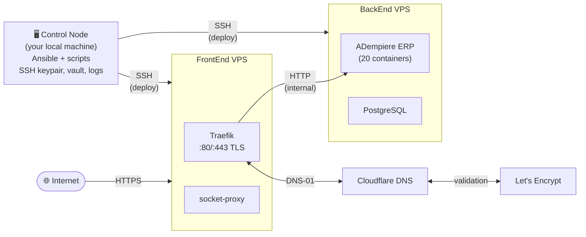
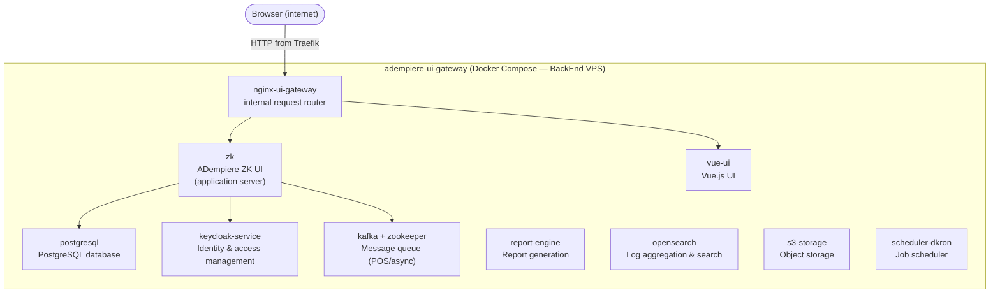

# Architecture

## Table of Contents

- [Three-entity model — control node, BackEnd, FrontEnd](#three-entity-model--control-node-backend-frontend)
- [Server layout](#server-layout)
- [BackEnd container stack](#backend-container-stack)
- [BackEnd direct accessibility](#-backend-direct-accessibility)
- [Multi-customer routing on the FrontEnd](#multi-customer-routing-on-the-frontend)
- [Request flow](#request-flow-normal-path-through-traefik)
- [TLS certificate issuance](#tls-certificate-issuance)
- [Docker network](#docker-network)
- [Security architecture](#security-architecture)

---

## Three-entity model — control node, BackEnd, FrontEnd

This project involves three distinct entities that must be understood separately:

| Entity | What it is | What runs on it |
|---|---|---|
| **Control node** | Your local workstation or laptop | Ansible, this project's scripts — nothing permanent |
| **BackEnd VPS** | Remote Linux server | ADempiere ERP + PostgreSQL, Docker Compose stack |
| **FrontEnd VPS** | Remote Linux server | Traefik reverse proxy, socket-proxy |

The control node is the orchestration point. All `ansible-playbook` commands and both entry-point scripts (`deploy-backend.sh`, `restore-db.sh`) are run from here. Ansible connects **outbound** over SSH; the servers never pull configuration.



---

## Server Layout

The system is split across two VPS servers, each with a distinct role:

```
Internet
    │
    ├───────────────────────────────────────────────────────────┐
    │                                                           │ ⚠ direct access possible
    ▼                                                           ▼
┌──────────────────────────────────────────┐  ┌───────────────────────────────────────┐
│  FrontEnd — <frontend_ip>                │  │  BackEnd — <backend_ip>               │
│                                          │  │                                       │
│  ┌────────────────┐  ┌────────────────┐  │  │  ┌─────────────────────────────────┐  │
│  │  Traefik       │  │  socket-proxy  │  │  │  │  adempiere-ui-gateway (Compose) │  │
│  │  :80 / :443    │◄─│  (Docker API)  │  │  │  │  - ADempiere application        │  │
│  │  TLS via ACME  │  └────────────────┘  │  │  │  - PostgreSQL :5432             │  │
│  └───────┬────────┘                      │  │  └─────────────┬───────────────────┘  │
└──────────▼───────────────────────────────┘  └────────────────▲──────────────────────┘
           │  HTTP (internal, no TLS)                          │
           └────────────────────────────────────────────────────
```

| Server | Ansible group | Role |
|---|---|---|
| `<frontend_ip>` | `FrontEnd` | Reverse proxy, TLS termination |
| `<backend_ip>` | `BackEnd` | ADempiere application + database |
| Both | `servers` | OS hardening, Docker, initial setup |
| `<test_ip>` | `ansible_test` | Local lab VM for testing |

> Actual IPs are configured in `inventories/hosts.yml` — gitignored. Use `inventories/hosts_template.yml` as reference.

---

## BackEnd container stack

The BackEnd runs the [adempiere-ui-gateway](https://github.com/adempiere/adempiere-ui-gateway) Docker Compose stack. The diagram below shows the key containers and their relationships.



For the runtime behaviour of this stack from the operator's perspective, see [how-it-works.md](how-it-works.md).

---

## ⚠ BackEnd Direct Accessibility

The BackEnd server has a public IP and is reachable directly from the internet.  
**This project does not configure any firewall** (no UFW, no iptables).  
Whether the BackEnd's application ports are publicly accessible depends entirely on the hosting provider's security group or firewall settings.

Different ports on the BackEnd require different access strategies:

| Port | Service | Access strategy |
|---|---|---|
| `custom_sshport` | SSH / SFTP | **Always open** — key-only auth, hardened. Also used as the tunnel for services below. |
| `5432` | PostgreSQL | **Never open directly.** Use an SSH tunnel for debugging (see below). |
| ADempiere app ports | ADempiere | **Closed** — all user traffic arrives via Traefik on the FrontEnd. |
| Kafka port | Kafka (POS queues) | **Restricted** — open only to the specific IPs of the POS systems, not to the whole internet. |

### Accessing PostgreSQL for debugging — SSH tunnel

Never open port 5432 to the internet. Instead, forward it through the already-open SSH connection:

```bash
# Forward remote port 5432 to your local machine's port 5432
ssh -L 5432:localhost:5432 <admin_user>@<backend_ip> -p <custom_sshport>

# In another terminal — connect to localhost as if you were on the server
psql -h localhost -p 5432 -U postgres
# or connect with DBeaver / pgAdmin to localhost:5432
```

The tunnel encrypts the database traffic inside SSH. No extra port needs to be opened on the firewall.

### Kafka access for POS queues

Kafka needs to be reachable by POS terminal systems, so its port cannot be completely blocked. Configure the hosting provider's firewall to allow the Kafka port **only from the known IPs of the POS systems**. All other source IPs should be blocked.

> **Note:** Kafka is not currently deployed by this Ansible project. These firewall rules must be configured manually at the hosting provider when Kafka is added to the stack.

---

## Multi-Customer Routing on the FrontEnd

The FrontEnd Traefik server can serve multiple customers simultaneously.  
Each customer is distinguished by their **hostname** (domain or subdomain).  
Traefik inspects the `Host` header of every incoming request and routes it to the correct BackEnd server according to its routing rules.

```
                        customer-a.example.com  ──►  BackEnd A  (IP-A)
Internet  ──►  Traefik
                        customer-b.example.com  ──►  BackEnd B  (IP-B)
```

Each customer requires:  
1. A DNS record pointing their domain to the FrontEnd IP  
2. A routing configuration file in `/docker/traefik/config/` on the **FrontEnd server**

The current project provides the template `roles/deploy-traefik/templates/app-adempiere.yaml.j2`.  
The `.j2` suffix is a naming convention meaning "this is a Jinja2 template — not a final file".  
It only exists in the repository.  
When `deploy-traefik.yml` runs, Ansible reads this template, substitutes all `{{ variable }}` placeholders with their actual values, and writes the final result as `app-adempiere.yaml` (without `.j2`) to `/docker/traefik/config/` on the FrontEnd server.  

This is specified explicitly in the deploy task:

```yaml
- src: 'app-adempiere.yaml.j2'    ← template in the repository
  dest: 'app-adempiere.yaml'      ← final file deployed on the server
```

So `app-adempiere.yaml` exists only on the FrontEnd server, never in the repository. Traefik watches that config directory and immediately applies any file placed there — no restart needed.

The key variable in that template is `adempiere_host`, which determines which hostname Traefik listens for.  
It is not set as a single value in one place — it is assembled from two pieces at runtime:

```
group_vars/all/vars.yml
  dns_domain: "your-domain.example.com"           ← you set this

roles/deploy-traefik/defaults/main.yml
  host: "adempiere"                               ← subdomain, hardcoded role default
  adempiere_host: "{{ host }}.{{ dns_domain }}"   ← assembled here

roles/deploy-traefik/templates/app-adempiere.yaml.j2
  rule: "Host(`{{ adempiere_host }}`)"            ← used in the routing rule

Result on the FrontEnd server after deployment:
  rule: "Host(`adempiere.your-domain.example.com`)"
```

To change the **domain**: edit `dns_domain` in `group_vars/all/vars.yml`.
To change the **subdomain**: override `host` in `group_vars/all/vars.yml` (e.g. `host: "erp"` would produce `erp.your-domain.example.com`).  
This covers one customer. For how to add a second customer in practice, see the **Adding a Customer** section in [operations.md](operations.md).

---

## Request Flow (normal path through Traefik)

1. User browser → `https://adempiere.<your-domain>`
2. DNS resolves to FrontEnd IP
3. Traefik on FrontEnd terminates TLS (certificate from Let's Encrypt)
4. Traefik matches the hostname against its routing rules (`app-adempiere.yaml`)
5. Request is forwarded over plain HTTP to BackEnd IP
6. ADempiere container processes the request

---

## TLS Certificate Issuance

Traefik uses the **ACME DNS-01 challenge** via the Cloudflare API:

1. Traefik requests a certificate from Let's Encrypt
2. Let's Encrypt asks Traefik to prove domain ownership by placing a DNS TXT record
3. Traefik calls the Cloudflare API to create the TXT record
4. Let's Encrypt verifies the record and issues the certificate
5. Traefik stores the certificate at `/docker/traefik/certs/cloudflare-acme.json`

This approach requires no public HTTP port for certificate issuance and works even if port 80 is blocked.

---

## Docker Network

- Network name: `gateway` (bridge driver)
- Created externally before containers start (by the `deploy-traefik` role)
- Both `traefik` and `socket-proxy` are attached to this network
- The ADempiere stack on BackEnd is accessed by IP, not via the Docker network

---

## Security Architecture

| Layer | Mechanism | Configured by this project |
|---|---|---|
| SSH access | Key-only, custom port, no root login, modern ciphers | Yes — `serversconf` role |
| Docker API | Access via socket-proxy (read-only) | Yes — `deploy-traefik` role |
| TLS | Let's Encrypt certificate, auto-renewed by Traefik | Yes — `deploy-traefik` role |
| OS patches | `unattended-upgrades` applies security updates automatically | Yes — `serversconf` role |
| Encrypted variables | Ansible Vault (AES-256) | Yes — `group_vars/all/vault.yml` |
| Network firewall | Block direct access to BackEnd ports | **No — must be configured at the hosting provider** |

---

[← Requirements](requirements.md) | [Next: Project Structure →](project-structure.md)
